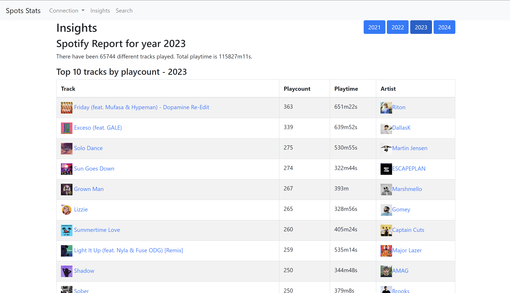
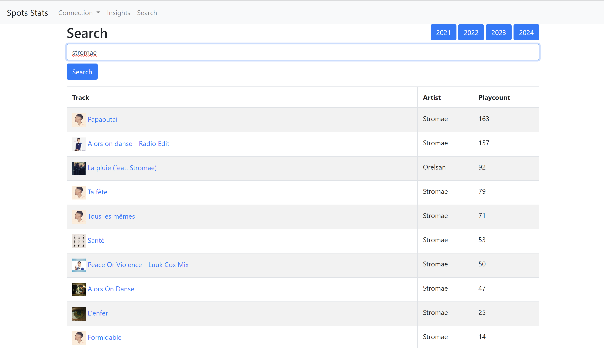
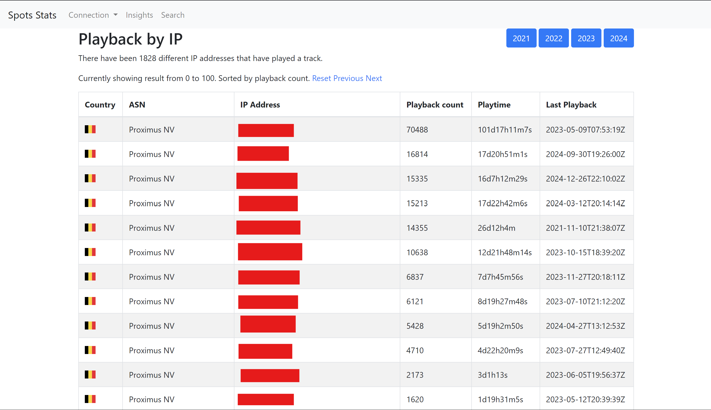
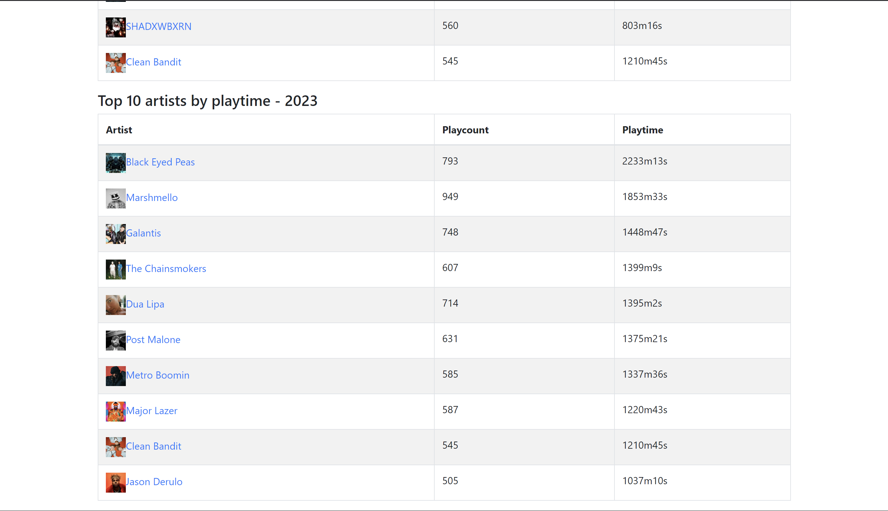

# SpotifySTATS

This application allows you to visualize your Spotify statistics using your data package, which you can request [here](https://spotify.com/account/privacy). It serves as an explorer for your Spotify data export, providing a user-friendly interface to delve into your listening habits. With this app, you can:

- View your top tracks and artists for each year, similar to Spotify Wrapped.
- Explore individual track streams and detailed metadata, including connection history.
- Enjoy an easy-to-use interface that makes navigating your Spotify data a breeze.

Whether you're curious about your listening trends or want to dive deep into your streaming history, this app offers a comprehensive and engaging way to explore your Spotify data.

## Screenshots

|  |  |
| ----------------------------------------------- | ----------------------------------------------- |
|  |  |

# Using the app

The application is using Flask.

- `spot_server.py` : the application server
- `spot_api.py` : flask blueprint to proxy spotify API calls
- `import.py` : script to import JSON files into `streaming_history.db`

You need to download [GeoLite2 database](https://github.com/P3TERX/GeoLite.mmdb) and put the files `GeoLite2-ASN.mmdb` and `GeoLite2-Country.mmdb` inside the `databases/` directory. There is a script `download_geolite2.py` to do it easily.

```bash
python download_geolite2.py
```

You also need to configure environment variables (`.env` file supported)

```conf
SPOTIFY_CLIENT_ID=<spotify app client id used for api_server.py>
SPOTIFY_CLIENT_SECRET=<spotify app client secret used for api_server.py>
```

> For redirect URI add `http://localhost:8888/callback` to spotify app.

## Usage

Copy your `Spotify Extended Streaming History` in root.

The content of folder `Spotify Extended Streaming History` should be .json files.

### Install dependecies

To install `spot_server.py` dependecies run
`pip install -r requirements.txt`

> You can setup a `venv` first. (tested with python 3.10)

### Run server

Start the server (debug mode) using

```sh
python spot_server.py
```

To use the server in production mode install gunicorn

```sh
pip install gunicorn
```

Start the production server:

```sh
python -m gunicorn -b 0.0.0.0:5000 spot_server:app
```

# Managed Hosting mode

Since there is a need of 1 application instance (and SQLite database per user). There is another hosting mode with `managed.py`. It uses docker container to setup a per-user instance of the app.

TODO...
